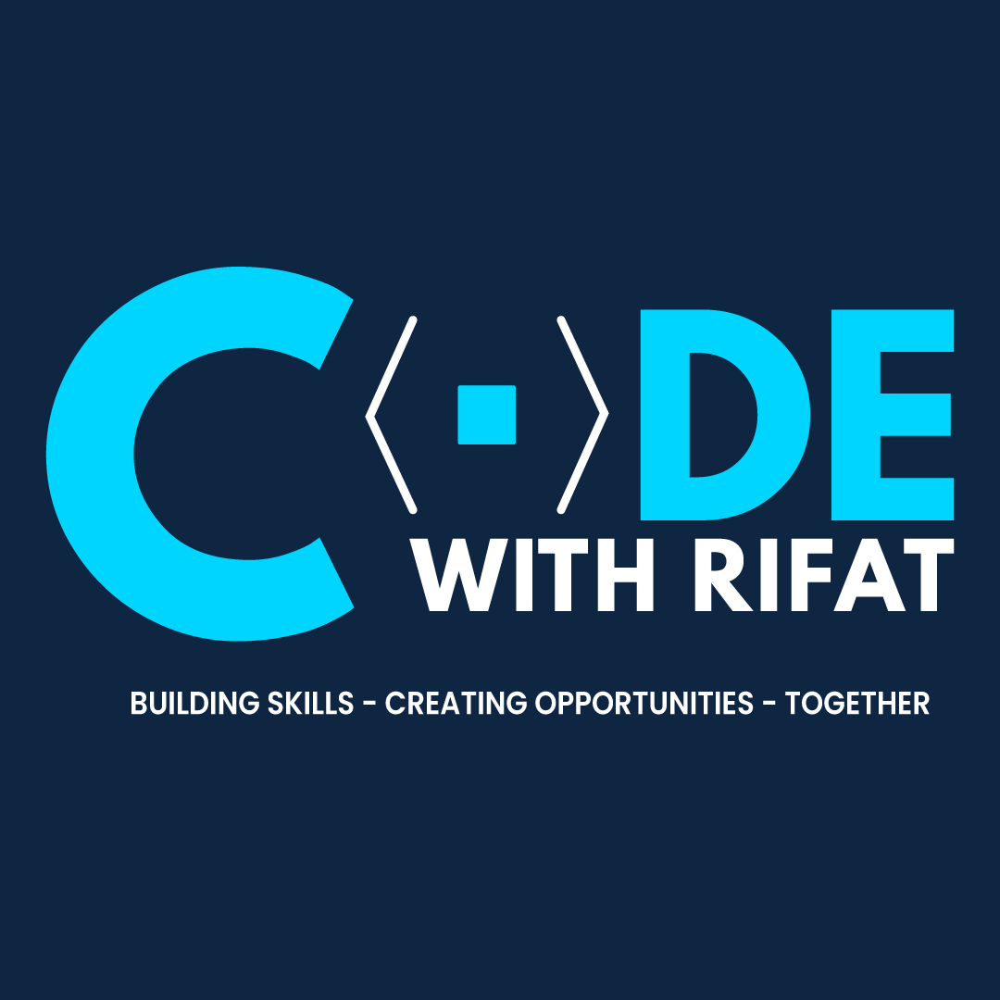

  
   

  <h3><b>Javascript API Project</b></h3>

# 📗 Table of Contents

- [📖 About the Project](#about-project)
  - [🛠 Built With](#built-with)
    - [Tech Stack](#tech-stack)
    - [Key Features](#key-features)
- [💻 Getting Started](#getting-started)
  - [Prerequisites](#prerequisites)
  - [Setup](#setup)
  - [Install](#install)
  - [Usage](#usage)
- [👥 Authors](#authors)
- [🔭 Future Features](#future-features)
- [🤝 Contributing](#contributing)
- [⭐️ Show your support](#support)
- [📝 License](#license)

# 📖 [Leaderboard Javascript API] 

**[Leaderboard Javascript API]** is a leaderboard website displays scores submitted by different players. It also allows you to submit your score. All data is preserved thanks to the external Leaderboard API service.

## 🛠 Built With 

### Tech Stack 
I have created this project only usine HTML,CSS and Javascript best practices of ES6. I have also used Webpack for this project.
### Key Features 

- **[Used HTML semantic tags for structure]**
- **[Used import export modules for styling and functions]**

(<a href="#readme-top">back to top</a>)

## 💻 Getting Started 

To get a local copy up and running, follow these steps =>
git clone https://github.com/Rifat8080/Javascript-API.git

### Prerequisites

In order to run this project you need:

npm init -y

### Setup

Clone this repository to your desired folder:

  cd my-folder  
  git clone https://github.com/Rifat8080/Javascript-API.git

### Install

Install this project with:

npm install

### Usage

To run the project, execute the following command:

npm start

(<a href="#readme-top">back to top</a>)

## 👥 Authors 

👤 **Md Mahadi Hasan Rifat**

- GitHub: [@githubhandle](https://github.com/Rifat8080)
- Twitter: [@twitterhandle](https://twitter.com/mdmahadirifat98)
- LinkedIn: [LinkedIn](https://www.linkedin.com/in/md-mahadi-hasan-rifat-8b7851265/)

(<a href="#readme-top">back to top</a>)

## 🔭 Future Features 

- [ ] **[API send and recieve data]**
- [ ] **[Better UI]**
- [ ] **[Better UX]**

(<a href="#readme-top">back to top</a>)

## 🤝 Contributing 

Contributions, issues, and feature requests are welcome!

Feel free to check the [issues page](https://github.com/Rifat8080/Javascript-API/issues).

(<a href="#readme-top">back to top</a>)

## ⭐️ Show your support 

If you like this project to show your support give this repo a STAR!

(<a href="#readme-top">back to top</a>)

## 📝 License 

This project is [MIT](https://github.com/Rifat8080/Javascript-API/blob/dev/LICENSE) licensed.

(<a href="#readme-top">back to top</a>)

